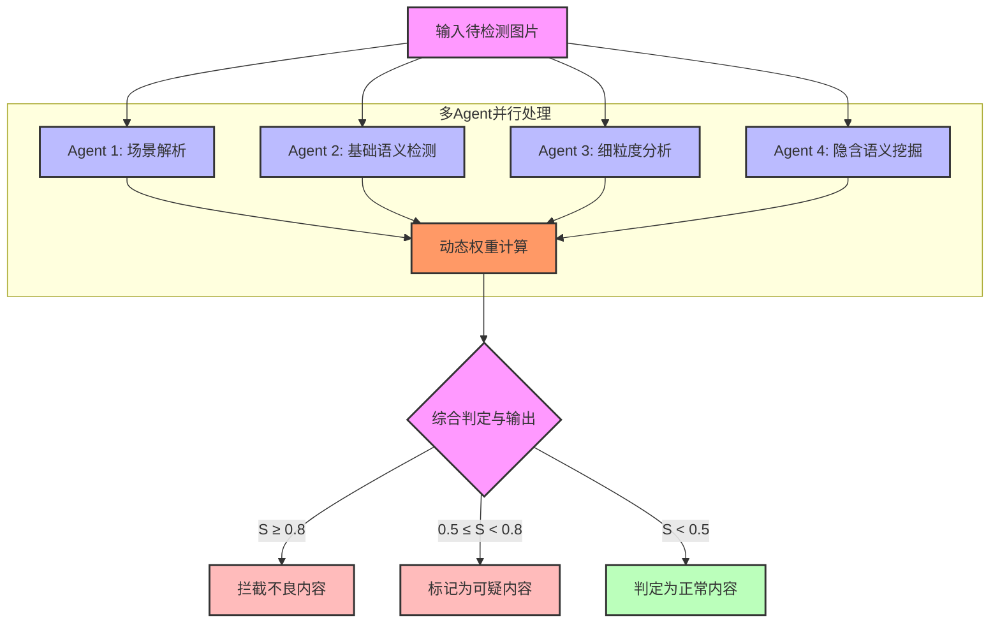

```mermaid
graph TD
    A[输入待检测图片] --> B1[Agent 1: 场景解析]
    A --> B2[Agent 2: 基础语义检测]
    A --> B3[Agent 3: 细粒度分析]
    A --> B4[Agent 4: 隐含语义挖掘]

    subgraph 多Agent并行处理
        B1 --> C[动态权重计算]
        B2 --> C
        B3 --> C
        B4 --> C
    end

    C --> D{综合判定与输出}
    D -->|S ≥ 0.8| E[拦截不良内容]
    D -->|0.5 ≤ S < 0.8| F[标记为可疑内容]
    D -->|S < 0.5| G[判定为正常内容]

    style A fill:#f9f,stroke:#333,stroke-width:2px
    style B1 fill:#bbf,stroke:#333,stroke-width:2px
    style B2 fill:#bbf,stroke:#333,stroke-width:2px
    style B3 fill:#bbf,stroke:#333,stroke-width:2px
    style B4 fill:#bbf,stroke:#333,stroke-width:2px
    style C fill:#f96,stroke:#333,stroke-width:2px
    style D fill:#f9f,stroke:#333,stroke-width:2px
    style E fill:#fbb,stroke:#333,stroke-width:2px
    style F fill:#fbb,stroke:#333,stroke-width:2px
    style G fill:#bfb,stroke:#333,stroke-width:2px
```
