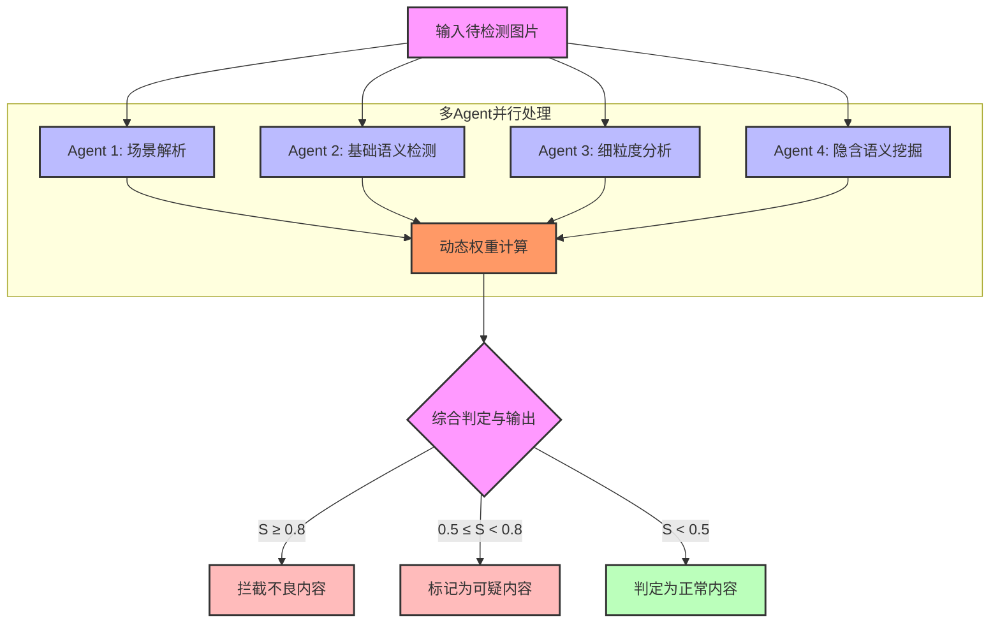
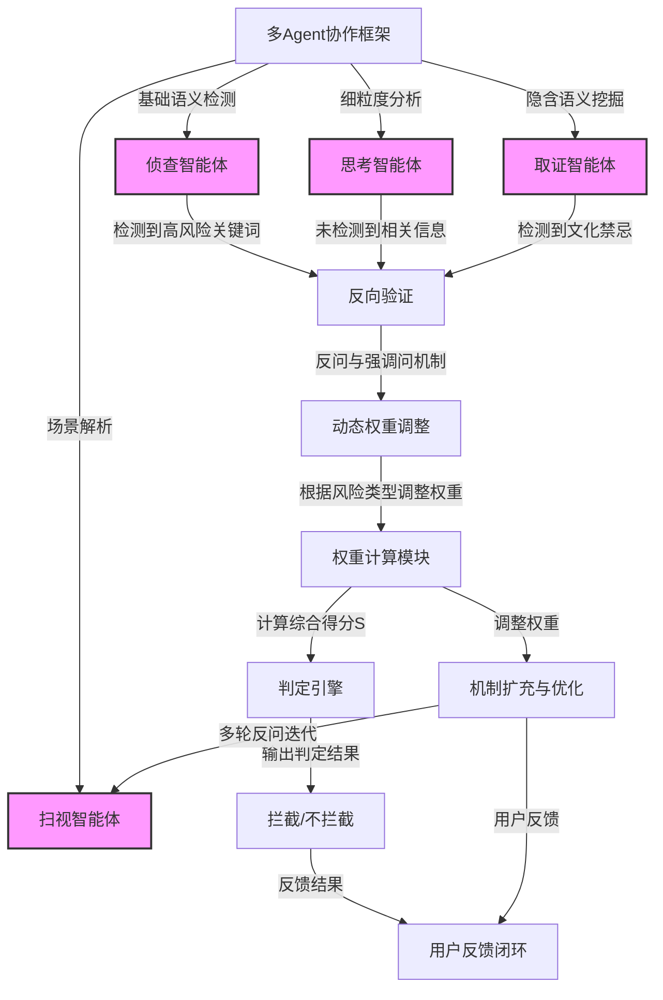
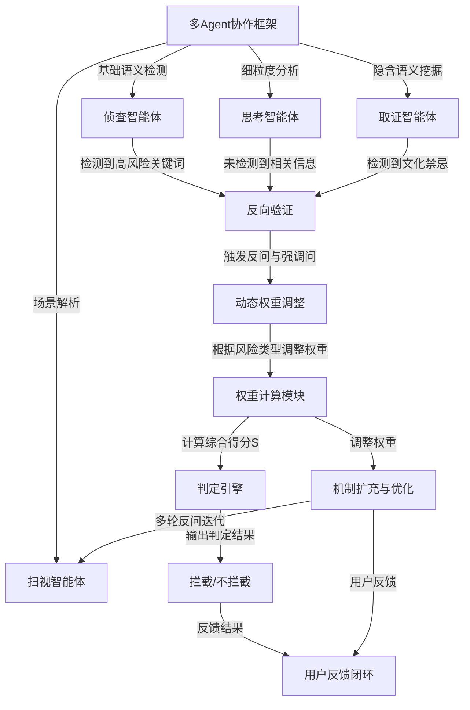
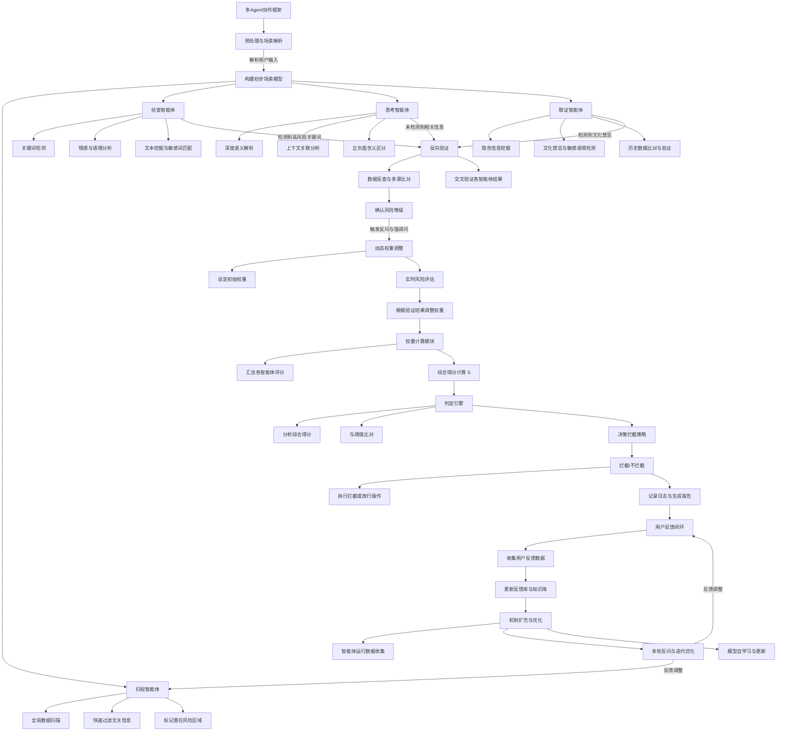

```mermaid
graph TD
    A[输入待检测图片] --> B1[Agent 1: 场景解析]
    A --> B2[Agent 2: 基础语义检测]
    A --> B3[Agent 3: 细粒度分析]
    A --> B4[Agent 4: 隐含语义挖掘]

    subgraph 多Agent并行处理
        B1 --> C[动态权重计算]
        B2 --> C
        B3 --> C
        B4 --> C
    end

    C --> D{综合判定与输出}
    D -->|S ≥ 0.8| E[拦截不良内容]
    D -->|0.5 ≤ S < 0.8| F[标记为可疑内容]
    D -->|S < 0.5| G[判定为正常内容]

    style A fill:#f9f,stroke:#333,stroke-width:2px
    style B1 fill:#bbf,stroke:#333,stroke-width:2px
    style B2 fill:#bbf,stroke:#333,stroke-width:2px
    style B3 fill:#bbf,stroke:#333,stroke-width:2px
    style B4 fill:#bbf,stroke:#333,stroke-width:2px
    style C fill:#f96,stroke:#333,stroke-width:2px
    style D fill:#f9f,stroke:#333,stroke-width:2px
    style E fill:#fbb,stroke:#333,stroke-width:2px
    style F fill:#fbb,stroke:#333,stroke-width:2px
    style G fill:#bfb,stroke:#333,stroke-width:2px
```

```mermaid
flowchart TD
    A1[多Agent协作框架] -->|场景解析| B1[扫视智能体]
    A1 -->|基础语义检测| B2[侦查智能体]
    A1 -->|细粒度分析| B3[思考智能体]
    A1 -->|隐含语义挖掘| B4[取证智能体]
    
    B2 -->|检测到高风险关键词| C1[反向验证]
    B3 -->|未检测到相关信息| C1
    B4 -->|检测到文化禁忌| C1
    
    C1 -->|反问与强调问机制| D1[动态权重调整]
    
    D1 -->|根据风险类型调整权重| E1[权重计算模块]
    E1 -->|计算综合得分S| F1[判定引擎]
    
    F1 -->|输出判定结果| G1[拦截/不拦截]
    
    G1 -->|反馈结果| H1[用户反馈闭环]
    
    E1 -->|调整权重| D2[机制扩充与优化]
    D2 -->|多轮反问迭代| B1
    D2 -->|用户反馈| H1

    classDef agent fill:#f9f,stroke:#333,stroke-width:2px;
    class B1,B2,B3,B4 agent;
    class C1,D1,E1,F1,G1,H1 fill:#ccf,stroke:#333,stroke-width:2px;
```

```mermaid
flowchart TD
    A1[多Agent协作框架] -->|场景解析| B1[扫视智能体]
    A1 -->|基础语义检测| B2[侦查智能体]
    A1 -->|细粒度分析| B3[思考智能体]
    A1 -->|隐含语义挖掘| B4[取证智能体]
    
    B2 -->|检测到高风险关键词| C1[反向验证]
    B3 -->|未检测到相关信息| C1
    B4 -->|检测到文化禁忌| C1
    
    C1 -->|触发反问与强调问| D1[动态权重调整]
    
    D1 -->|根据风险类型调整权重| E1[权重计算模块]
    E1 -->|计算综合得分S| F1[判定引擎]
    
    F1 -->|输出判定结果| G1[拦截/不拦截]
    
    G1 -->|反馈结果| H1[用户反馈闭环]
    
    E1 -->|调整权重| D2[机制扩充与优化]
    D2 -->|多轮反问迭代| B1
    D2 -->|用户反馈| H1
```

```mermaid
flowchart TD
    %% 整体框架与预处理
    A1[多Agent协作框架] --> A2[预处理与场景解析]
    A2 -->|解析用户输入| A3[构建初步场景模型]
    
    %% 四大智能体展开
    A3 --> B1[扫视智能体]
    A3 --> B2[侦查智能体]
    A3 --> B3[思考智能体]
    A3 --> B4[取证智能体]
    
    %% 扫视智能体内部细化
    B1 --> B1a[全局数据扫描]
    B1 --> B1b[快速过滤无关信息]
    B1 --> B1c[标记潜在风险区域]
    
    %% 侦查智能体内部细化
    B2 --> B2a[关键词检测]
    B2 --> B2b[情感与语境分析]
    B2 --> B2c[文本挖掘与敏感词匹配]
    
    %% 思考智能体内部细化
    B3 --> B3a[深度语义解析]
    B3 --> B3b[上下文关联分析]
    B3 --> B3c[正负面含义区分]
    
    %% 取证智能体内部细化
    B4 --> B4a[隐含信息挖掘]
    B4 --> B4b[文化禁忌与敏感语境检测]
    B4 --> B4c[历史数据比对与验证]
    
    %% 反向验证触发条件
    B2 -->|检测到高风险关键词| C1[反向验证]
    B3 -->|未检测到相关信息| C1
    B4 -->|检测到文化禁忌| C1
    
    %% 反向验证详细步骤
    C1 --> C1a[数据反查与多源比对]
    C1 --> C1b[交叉验证各智能体结果]
    C1a --> C2[确认风险等级]
    
    %% 动态权重调整模块
    C2 -->|触发反问与强调问| D1[动态权重调整]
    D1 --> D1a[设定初始权重]
    D1 --> D1b[实时风险评估]
    D1b --> D1c[根据验证结果调整权重]
    
    %% 权重计算模块详细步骤
    D1c --> E1[权重计算模块]
    E1 --> E1a[汇总各智能体评分]
    E1 --> E1b[综合得分计算 S]
    
    %% 判定引擎细化
    E1b --> F1[判定引擎]
    F1 --> F1a[分析综合得分]
    F1 --> F1b[与阈值比对]
    F1 --> F1c[决策拦截策略]
    
    %% 拦截与执行反馈
    F1c --> G1[拦截/不拦截]
    G1 --> G1a[执行拦截或放行操作]
    G1 --> G1b[记录日志与生成报告]
    
    %% 用户反馈闭环
    G1b --> H1[用户反馈闭环]
    H1 --> H1a[收集用户反馈数据]
    H1a --> H1b[更新反馈库与知识库]
    
    %% 机制扩充与优化（闭环反馈）
    H1b --> D2[机制扩充与优化]
    D2 --> D2a[智能体运行数据收集]
    D2 --> D2b[多轮反问与迭代优化]
    D2 --> D2c[模型自学习与更新]
    D2b -->|反馈调整| B1
    D2b -->|反馈调整| H1
```
