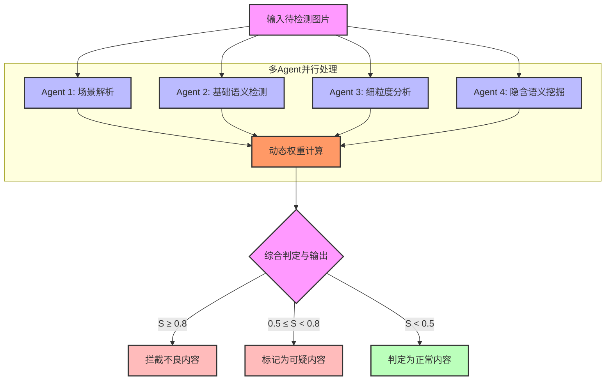
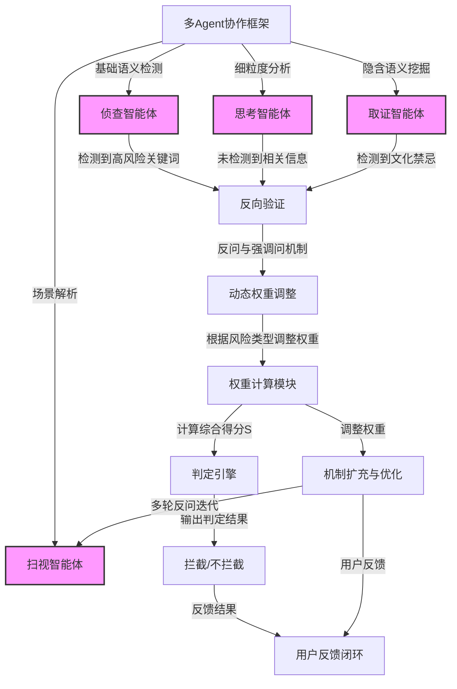
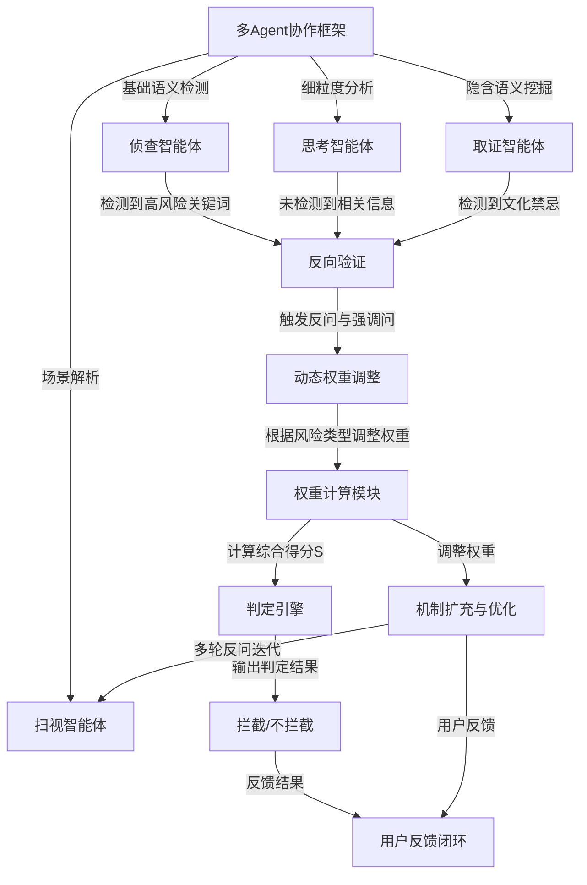

```mermaid
graph TD
    A[输入待检测图片] --> B1[Agent 1: 场景解析]
    A --> B2[Agent 2: 基础语义检测]
    A --> B3[Agent 3: 细粒度分析]
    A --> B4[Agent 4: 隐含语义挖掘]

    subgraph 多Agent并行处理
        B1 --> C[动态权重计算]
        B2 --> C
        B3 --> C
        B4 --> C
    end

    C --> D{综合判定与输出}
    D -->|S ≥ 0.8| E[拦截不良内容]
    D -->|0.5 ≤ S < 0.8| F[标记为可疑内容]
    D -->|S < 0.5| G[判定为正常内容]

    style A fill:#f9f,stroke:#333,stroke-width:2px
    style B1 fill:#bbf,stroke:#333,stroke-width:2px
    style B2 fill:#bbf,stroke:#333,stroke-width:2px
    style B3 fill:#bbf,stroke:#333,stroke-width:2px
    style B4 fill:#bbf,stroke:#333,stroke-width:2px
    style C fill:#f96,stroke:#333,stroke-width:2px
    style D fill:#f9f,stroke:#333,stroke-width:2px
    style E fill:#fbb,stroke:#333,stroke-width:2px
    style F fill:#fbb,stroke:#333,stroke-width:2px
    style G fill:#bfb,stroke:#333,stroke-width:2px
```

```mermaid
flowchart TD
    A1[多Agent协作框架] -->|场景解析| B1[扫视智能体]
    A1 -->|基础语义检测| B2[侦查智能体]
    A1 -->|细粒度分析| B3[思考智能体]
    A1 -->|隐含语义挖掘| B4[取证智能体]
    
    B2 -->|检测到高风险关键词| C1[反向验证]
    B3 -->|未检测到相关信息| C1
    B4 -->|检测到文化禁忌| C1
    
    C1 -->|反问与强调问机制| D1[动态权重调整]
    
    D1 -->|根据风险类型调整权重| E1[权重计算模块]
    E1 -->|计算综合得分S| F1[判定引擎]
    
    F1 -->|输出判定结果| G1[拦截/不拦截]
    
    G1 -->|反馈结果| H1[用户反馈闭环]
    
    E1 -->|调整权重| D2[机制扩充与优化]
    D2 -->|多轮反问迭代| B1
    D2 -->|用户反馈| H1

    classDef agent fill:#f9f,stroke:#333,stroke-width:2px;
    class B1,B2,B3,B4 agent;
    class C1,D1,E1,F1,G1,H1 fill:#ccf,stroke:#333,stroke-width:2px;
```

```mermaid
flowchart TD
    A1[多Agent协作框架] -->|场景解析| B1[扫视智能体]
    A1 -->|基础语义检测| B2[侦查智能体]
    A1 -->|细粒度分析| B3[思考智能体]
    A1 -->|隐含语义挖掘| B4[取证智能体]
    
    B2 -->|检测到高风险关键词| C1[反向验证]
    B3 -->|未检测到相关信息| C1
    B4 -->|检测到文化禁忌| C1
    
    C1 -->|触发反问与强调问| D1[动态权重调整]
    
    D1 -->|根据风险类型调整权重| E1[权重计算模块]
    E1 -->|计算综合得分S| F1[判定引擎]
    
    F1 -->|输出判定结果| G1[拦截/不拦截]
    
    G1 -->|反馈结果| H1[用户反馈闭环]
    
    E1 -->|调整权重| D2[机制扩充与优化]
    D2 -->|多轮反问迭代| B1
    D2 -->|用户反馈| H1
```
